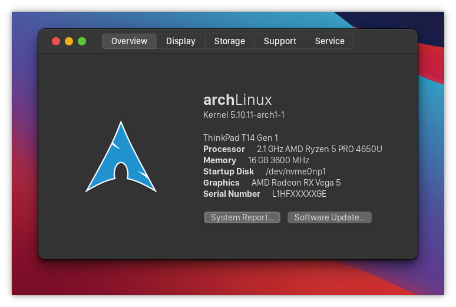
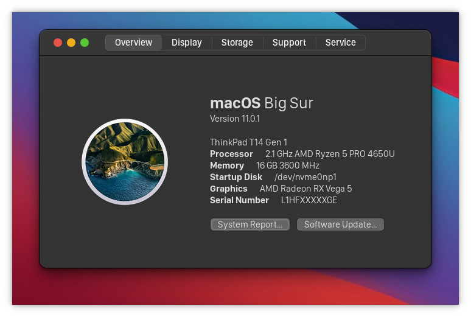

# About this fake Mac

The "About this Mac" that most macOS rices miss.

<center>


</center>

# Introduction
- I love macOS, because it profits both advantages of Linux and Windows: a Unix shell, and the abundance of popular industry standard softwares (like Microsoft Office, Adobe *, ...). The most important thing is that its UI is soooo stunning!<br>
I had used it for about a year on a Hackintosh until upgraded to a more powerful machine, but it is powered by an AMD Ryzen CPU. So, no more Hackintosh. I found my way (back) to Arch Linux and KDE Plasma (actually I had used them prior to macOS) and did all the ricing stuff (you can find my setup [here](https://github.com/hungngocphat01/KDEintosh)). I realized that all macOS rices ever always miss one thing: the "About this Mac" window. That's why I created this - a simple GTK 3.0 application to mimic it.
- This software is still under development.

# Dependencies
- No extra dependencies so far exept gtk3 and pygobject.

# How to use
- Get and apply a GTK macOS theme first. `WhiteSur-dark-gtk` is highly recommeded.
- Git clone this repo to somewhere.
- I hadn't written a complete makefile for this one, so to run it just issue the following command without installing anything for now:
    ```bash
    python3 main.py
    ```
- I have not implemented any sort of system specs auto detection, so you have to specify your PC information in `overview-info.json`. I also have not done some dynamic way to detect window margins nicely on different resolutions (mine is 1080p with 1.0 scale). So do note that 
    - `distro_markup` must be in valid [pango Markup syntax](https://developer.gnome.org/pango/stable/pango-Markup.html). It looks like HTML but isn't, so don't assume HTML styling logics on it.
    - `distro_image_size`: a list of 2 floats which is the width and height of the distro logo respectively.
    - `overview_margins`: the margin (space from content to the window edges) of the Overview window. It is a list of 4 floats, which are the left, right, top and bottom margin respectively.
    - `logo_space`: distance from the distro logo to the information list. Should be equal to left margin for nice justification.
    - I think the other entries are clear enough to configure.

# Roadmap
- Implement some sort of auto detect hardware specification.

# Changelog
```
v0.1 (02/02/2021)
- Initial build.
```
